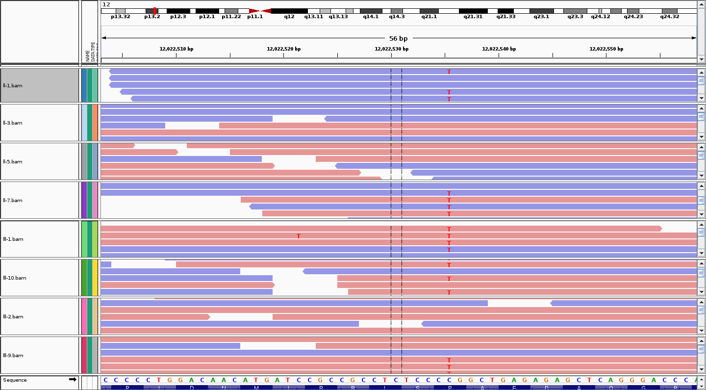

.. include:: /_static/substitutions.txt

*******************************
Class 24 : Exome-Seq - Variants
*******************************

:Class date: |c24-date|
:Last updated: |today|

Goals
=====

#. BAM format
#. VCF format
#. Filter VCF

BAMs
====

BAMs are the alignment format. Here is one where we've marked
duplicates.

.. code-block:: bash

    samtools view -h /vol1/opt/data/exomes/results/ll-7.dedup.bam | less

Variant Call Format (VCF)
=========================

http://www.1000genomes.org/wiki/Analysis/Variant%20Call%20Format/vcf-variant-call-format-version-41

Our VCFs contain the 8 samples in columns 10+. They are split by chromosome.

We want to filter our VCF according to our study design.

Project Design
==============

.. image:: ../_static/images/phenotype.png

SNPEff/SNPSift
==============

+ find **Eff** ect of variant (missense/nonsense/etc)
+ filter variants by presence in DBSNP
+ filter variants by genotype across samples
+ filter variants by *lots of stuff*

http://snpeff.sourceforge.net/SnpEff_manual.html

Remember we annotated with DBSNP and by effect.

Java
====

.. code-block:: bash

    module load java/1.7
    qlogin
    java -Xmx4G -jar /vol1/opt/data/exomes/snpEff/SnpSift.jar

Filters
=======

+ Get variants with quality score greater than 40:

.. code-block:: bash

    cat  ~brentp/exomes/results/vcfs/chr18.snpeff.dbsnp.vcf | \
    java -Xmx4G -jar ~brentp/opt/snpEff/SnpSift.jar \
     filter  "((QUAL >= 40))" | less

Filters II
==========

To (kinda) match the study design. Get variants with:

+ quality score greater than 40
+ with 5 hets and 3 reference 
+ high/moderate impact

.. code-block:: bash

    cat  /vol1/opt/data/exomes/results/vcfs/chr18.snpeff.dbsnp.vcf | \
    java -Xmx4G -jar /vol1/opt/data/exomes/snpEff/SnpSift.jar \
     filter  "(
     (QUAL >= 40) &
     (countHet() = 5 & countRef() = 3) &
     ((EFF[*].IMPACT = 'HIGH') | (EFF[*].IMPACT = 'MODERATE'))
     ) " | less

NOTE extra parens around impact of `HIGH` or `MODERATE`

How many variants does that give us?

Filters III
===========

Many more filtering options here:
http://snpeff.sourceforge.net/SnpSift.html

For example: check if the first sample's genotype is a variant
and the 2nd samples is reference

    "isVariant(GEN[0]) & isRef(GEN[1])"

*use this to extract variants that match our exact criteria*

Filters Applied
===============

Look at the header in a VCF:

.. code-block:: bash

    $ grep -m 1 "#CHROM" ~brentp/exomes/results/vcfs/chr18.snpeff.dbsnp.vcf 
    #CHROM  POS ID  REF ALT QUAL    FILTER  INFO    FORMAT  ll-1    ll-3    ll-5
    ll-7    lll-1   lll-10  lll-2   lll-9

Match that sample order with the pedigree image to get a filter like::

    isVariant(GEN[0]) & isVariant(GEN[3]) \
        & isVariant(GEN[4]) ...

Filtered
========

.. code-block:: bash

    cat  /vol1/opt/data/exomes/results/vcfs/chr*.snpeff.dbsnp.vcf | \
    java -Xmx4G -jar /vol1/opt/data/exomes/snpEff/SnpSift.jar \
        filter  \
        "((QUAL >= 40) & isVariant(GEN[0]) & isVariant(GEN[3]) \
        & isVariant(GEN[4]) & isVariant(GEN[7]) & isVariant(GEN[5]) \
        & isRef(GEN[1]) & isRef(GEN[2]) & isRef(GEN[6]) \
        & (DP >= 40) \
        & (( na FILTER) | (FILTER = 'PASS')) \
        & ((EFF[*].IMPACT = 'HIGH') | (EFF[*].IMPACT = 'MODERATE'))
            )"

Since we are likely interested in novel variants, we can then filter
to exclude things with an `rs` number.

Viewing on UCSC
===============

    http://genome.ucsc.edu/cgi-bin/hgTracks?db=hg19&position=chr12%3A12022530-12022539&hg.customText=http://amc-sandbox.ucdenver.edu/~brentp/exome-region/info.bed

Viewing in IGV
==============

Viewing with samtools tview
===========================

.. code-block:: bash

    samtools tview -p chr12:12022535 \
        /vol1/opt/data/exomes/results/ll-1.dedup.bam \
        /vol3/home/jhessel/ref/genomes/hg19/hg19.fa

Extracting parts of the alignment
=================================

When you only want to look at part of the alignment. No need to transfer
20GB of `BAM` files to your laptop

.. code-block:: bash

    samtools view -h results/$sample.dedup.bam 12:12022035-12023035 \
            > save.$sample.bam

will save on the portion that we are interested in.
