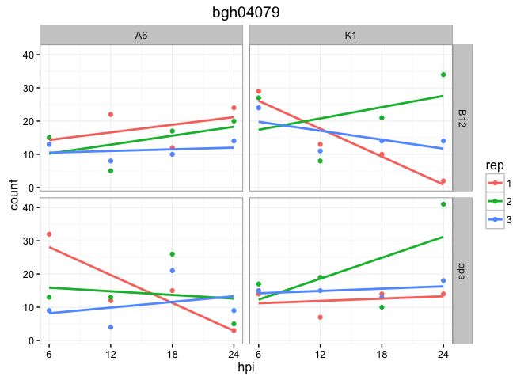
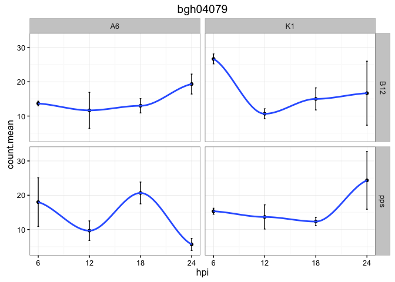

# Plant RNA-seq
Jay Hesselberth  
January 2, 2016  

XXX: describe general setup

We will examine a [time-course of mRNA expression][1] of barley powdery mildew fungus in immunocompromised plants (*Arabidopsis*). The fungus Blumeria graminis f. sp. hordei (called *Bgh* from now on)

Counts were generated using the [`maSigPro` software][3] and deposited in [NCBI GEO][2].

[1]: http://www.ncbi.nlm.nih.gov/pubmed/23175786
[2]: http://www.ncbi.nlm.nih.gov/geo/query/acc.cgi?acc=GSE43163  
[3]: http://bioinformatics.oxfordjournals.org/content/30/18/2598.full

Some important identifiers for the data set:

| Name | Description |
| ---- | ----------- |
| `A6` | *Bgh* isolate expressing other AVRA effectors |
| `K1` | *Bgh* isolate expressing the cognate AVRA1 effector for MLA1|
| `pps` | *Arabidopsis* plants |
| `B12` | *Arabidopsis* plants expressing MLA1-HA|

We will download tables from GEO containing counts of mRNA abundance from both the fungus and plant (separately) as measured by the `XXX` package.


```r
library(readr)
library(tidyr)
library(dplyr)
library(stringr)

# bgh data
bgh_url <- 'http://www.ncbi.nlm.nih.gov/geo/download/?acc=GSE43163&format=file&file=GSE43163_CompleteCountTable_Bgh.txt.gz'
# At data
ath_url <- 'http://www.ncbi.nlm.nih.gov/geo/download/?acc=GSE39463&format=file&file=GSE39463_CompleteCountTable_At.txt.gz'

# 2 info and blank lines at top, skip them
raw_tab_bgh <- read_tsv(bgh_url, skip = 2)
# fix NA for gene name
names(raw_tab_bgh)[1] <- 'gene.name'

# columns headers for this file are malformed; there is no header for the gene.name. need to set them manually
col.headers <- read_lines(ath_url, n_max = 1) 
col.headers <- str_split(col.headers, '\t')[[1]]
# add gene.name
col.headers <- c('gene.name', col.headers)

raw_tab_at <- read_tsv(ath_url, col_names = col.headers, skip = 1)

head(raw_tab_bgh)
```

```
## Source: local data frame [6 x 49]
## 
##             gene.name B12_A6_6hpi_1 B12_A6_6hpi_2 B12_A6_6hpi_3
##                 (chr)         (int)         (int)         (int)
## 1            bgh04079            13            15            13
## 2            bgh01634            31            10            24
## 3 bghG000012000001001           121           119           145
## 4 bghG000012000002001             3             2             0
## 5            bgh00757           253           191           207
## 6            bgh01273            45            27            48
## Variables not shown: B12_A6_12hpi_1 (int), B12_A6_12hpi_2 (int),
##   B12_A6_12hpi_3 (int), B12_A6_18hpi_1 (int), B12_A6_18hpi_2 (int),
##   B12_A6_18hpi_3 (int), B12_A6_24hpi_1 (int), B12_A6_24hpi_2 (int),
##   B12_A6_24hpi_3 (int), B12_K1_6hpi_1 (int), B12_K1_6hpi_2 (int),
##   B12_K1_6hpi_3 (int), B12_K1_12hpi_1 (int), B12_K1_12hpi_2 (int),
##   B12_K1_12hpi_3 (int), B12_K1_18hpi_1 (int), B12_K1_18hpi_2 (int),
##   B12_K1_18hpi_3 (int), B12_K1_24hpi_1 (int), B12_K1_24hpi_2 (int),
##   B12_K1_24hpi_3 (int), pps_A6_6hpi_1 (int), pps_A6_6hpi_2 (int),
##   pps_A6_6hpi_3 (int), pps_A6_12hpi_1 (int), pps_A6_12hpi_2 (int),
##   pps_A6_12hpi_3 (int), pps_A6_18hpi_1 (int), pps_A6_18hpi_2 (int),
##   pps_A6_18hpi_3 (int), pps_A6_24hpi_1 (int), pps_A6_24hpi_2 (int),
##   pps_A6_24hpi_3 (int), pps_K1_6hpi_1 (int), pps_K1_6hpi_2 (int),
##   pps_K1_6hpi_3 (int), pps_K1_12hpi_1 (int), pps_K1_12hpi_2 (int),
##   pps_K1_12hpi_3 (int), pps_K1_18hpi_1 (int), pps_K1_18hpi_2 (int),
##   pps_K1_18hpi_3 (int), pps_K1_24hpi_1 (int), pps_K1_24hpi_2 (int),
##   pps_K1_24hpi_3 (int).
```

```r
head(raw_tab_at)
```

```
## Source: local data frame [6 x 49]
## 
##   gene.name B12_A6_6hpi_1 B12_A6_6hpi_2 B12_A6_6hpi_3 B12_A6_12hpi_1
##       (chr)         (int)         (int)         (int)          (int)
## 1 AT1G44110            99            51            41             36
## 2 AT1G04050           116            52            55            157
## 3 AT1G06830           181           130           105            538
## 4 AT1G09720            32            34            12             54
## 5 AT1G15230           286           208           216            169
## 6 AT1G27170           546           384           362            271
## Variables not shown: B12_A6_12hpi_2 (int), B12_A6_12hpi_3 (int),
##   B12_A6_18hpi_1 (int), B12_A6_18hpi_2 (int), B12_A6_18hpi_3 (int),
##   B12_A6_24hpi_1 (int), B12_A6_24hpi_2 (int), B12_A6_24hpi_3 (int),
##   B12_K1_6hpi_1 (int), B12_K1_6hpi_2 (int), B12_K1_6hpi_3 (int),
##   B12_K1_12hpi_1 (int), B12_K1_12hpi_2 (int), B12_K1_12hpi_3 (int),
##   B12_K1_18hpi_1 (int), B12_K1_18hpi_2 (int), B12_K1_18hpi_3 (int),
##   B12_K1_24hpi_1 (int), B12_K1_24hpi_2 (int), B12_K1_24hpi_3 (int),
##   pps_A6_6hpi_1 (int), pps_A6_6hpi_2 (int), pps_A6_6hpi_3 (int),
##   pps_A6_12hpi_1 (int), pps_A6_12hpi_2 (int), pps_A6_12hpi_3 (int),
##   pps_A6_18hpi_1 (int), pps_A6_18hpi_2 (int), pps_A6_18hpi_3 (int),
##   pps_A6_24hpi_1 (int), pps_A6_24hpi_2 (int), pps_A6_24hpi_3 (int),
##   pps_K1_6hpi_1 (int), pps_K1_6hpi_2 (int), pps_K1_6hpi_3 (int),
##   pps_K1_12hpi_1 (int), pps_K1_12hpi_2 (int), pps_K1_12hpi_3 (int),
##   pps_K1_18hpi_1 (int), pps_K1_18hpi_2 (int), pps_K1_18hpi_3 (int),
##   pps_K1_24hpi_1 (int), pps_K1_24hpi_2 (int), pps_K1_24hpi_3 (int).
```

But you'll notice that these counts tables are *messy*, so our first charge is to make them `tidyr`. See how the plant, virus, hpi and replicate designations are column names? That makes for efficient data storage, but does not enable efficient data analysis.


```r
# because these tables have identical structure, can write a function that applies to both.
clean_data <- function(raw_data, org, ...) {
  cleaned_data <- raw_data %>%
    gather(key, count, -gene.name) %>%
    separate(key, into = c('plant', 'virus', 'hpi', 'rep'), sep = '_') %>%
    mutate(hpi = as.integer(str_replace(hpi, 'hpi', ''))) %>%
    mutate(org.name = as.factor(org),
           gene.name = as.factor(gene.name),
           plant = as.factor(plant),
           virus = as.factor(virus),
           rep = as.factor(rep))
    
  cleaned_data 
}

cleaned_data_bgh <- clean_data(raw_tab_bgh, org = 'bgh')
cleaned_data_at <- clean_data(raw_tab_at, org = 'at')

cleaned_data <- bind_rows(cleaned_data_bgh, cleaned_data_at) %>%
  mutate(org.name = as.factor(org.name))
```

```
## Warning in bind_rows_(x, .id): Unequal factor levels: coercing to character
```

```
## Warning in bind_rows_(x, .id): Unequal factor levels: coercing to character
```

Let's look at some summary statistics of the combined table.


```r
cleaned_data %>%
  group_by(org.name) %>%
  summarize(n.genes = n(),
            max.exp = max(count))
```

```
## Source: local data frame [2 x 3]
## 
##   org.name n.genes max.exp
##     (fctr)   (int)   (int)
## 1       at 1568544 1931803
## 2      bgh  310896    6838
```

Let's look at the expression of a specific gene in the data set.


```r
library(ggplot2)
select.gene <- 'bgh04079'

# for x-axis of plots
hpi.breaks <- unique(cleaned_data$hpi)

cleaned_data %>%
  filter(gene.name == select.gene) %>%
  ggplot(aes(x=hpi, y=count, color=rep)) +
    geom_point() + geom_smooth(method='lm', se = FALSE) +
    facet_grid(plant ~ virus) + theme_bw() +
    scale_x_continuous(breaks = hpi.breaks) +
    ggtitle(select.gene)
```

 

We can see that the linear fits between replicates don't really match up. We'll see if we can learn some more with simple statistics.

Now we'll do some simple statistics on the counts to get the mean and standard error for the replicates. Note that `rep` is not part of the `group_by` call, so the counts from each of the 3 replicates form the group.


```r
count_stats <- cleaned_data %>%
  group_by(org.name, plant, virus, gene.name, hpi) %>%
  summarize(count.mean = mean(count),
            count.se = sqrt(var(count) / n()))
```

Let's replot those data and see how things change.


```r
select.gene <- 'bgh04079'

gene_stats <- count_stats %>%
  filter(gene.name == select.gene)

# from geom_errorbar webpage
limits <- aes(ymax = count.mean + count.se, ymin = count.mean - count.se)
  
ggplot(gene_stats, aes(x=hpi, y=count.mean)) +
  geom_point() + geom_errorbar(limits, width=0.2) +
  geom_smooth(method='loess', se = FALSE) +
  scale_x_continuous(breaks = hpi.breaks) +
  facet_grid(plant ~ virus) + theme_bw() +
  ggtitle(select.gene)
```

 


Now we do some modeling of gene expression. Because we have replicates, we can take advantage of the extended capabilities of the `lme4` package.


```r
library(broom)
linear_models <- cleaned_data %>%
  group_by(gene.name, plant, virus, rep) %>%
  do(tidy(lm(count ~ hpi, .)))

intercept_terms <- linear_models %>%
  ungroup() %>%
  filter(term == '(Intercept)')   

intercept_terms
```
