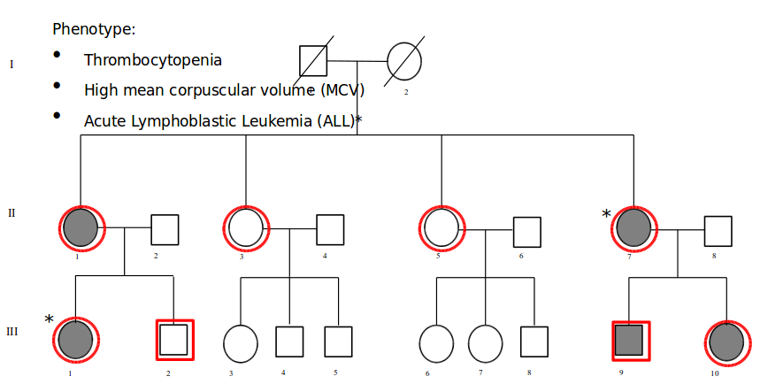

*******************************
Class 26 : Exome-Seq - Variants
*******************************

Goals
=====

 #. Review cluster usage
 #. BAM format
 #. VCF format
 #. Filter VCF

LSF Job Arrays
==============

Run a command (`bwa mem`) on 8 samples

.. code-block:: bash

    #BSUB -J align[1-8]
    
    samples=(ll-1 ll-3 ll-5 ll-7 lll-10 
             lll-1 lll-2 lll-9)
    sample=${samples[$(($LSB_JOBINDEX - 1))]}

    R1=$FQDIR/${sample}_R1_001.fastq.gz
    R2=$FQDIR/${sample}_R2_001.fastq.gz

    bwa mem hg19.fa $R1 $R2 > $sample.sam

LSF Job Arrays II
=================

Same pipeline on different data (16 samples)

.. code-block:: bash

    #BSUB -J align[1-16]

    samples=(1_Y_Spleen_10_28_ATCACG 2_Y_10_31_CGATGT 3_Y2_11_25_TTAGGC
    4_M_Spleen_10_28_TGACCA .. [16 total samples] ..)
    
    sample=${samples[$(($LSB_JOBINDEX - 1))]}

    R1=$FQDIR/${sample}_L008_R1_001.fastq.gz
    R2=$FQDIR/${sample}_L008_R2_001.fastq.gz

    bwa mem mm10.fa $R1 $R2 > $sample.sam

Exercise
========

use a job array to submit a script 10 times where
each on echos it's number in the array::

    hello from 1
    hello from 2
    ...
    hello from 10

specify `#BSUB -e hello.%I.%J.err` and `#BSUB -o hello.%I.%J.out`

usually good to debug with a single job::

    #BSUB -J hello[1]

then expand to number of jobs once that works.

BAMs
====

BAMs are the alignment format. Here is one where we've marked
duplicates.

.. code-block:: bash

    samtools view -h ~brentp/exomes/results/ll-7.dedup.bam | less

Variant Call Format (VCF)
=========================

http://www.1000genomes.org/wiki/Analysis/Variant%20Call%20Format/vcf-variant-call-format-version-41

Our VCFs contain the 8 samples in columns 10+. They are split by chromosome.

We want to filter our VCF according to our study design.

Project Design
==============

SNPEff/SNPSift
==============

 + find **Eff** ect of variant (missense/nonsense/etc)
 + filter variants by presence in DBSNP
 + filter variants by genotype across samples
 + filter variants by *lots of stuff*

http://snpeff.sourceforge.net/SnpEff_manual.html

Remember we annotated with DBSNP and by effect.

Java
====

    module load java/1.7
    qlogin
    java -Xmx4G -jar ~brentp/opt/snpEff/SnpSift.jar

Filters
=======

 + Get variants with quality score greater than 40:

.. code-block:: bash

    cat  ~brentp/exomes/results/vcfs/chr18.snpeff.dbsnp.vcf | \
    java -Xmx4G -jar ~brentp/opt/snpEff/SnpSift.jar \
     filter  "((QUAL >= 40))" | less

Filters II
==========

Get variants with quality score greater than 40 with 5
hets and 3 reference to sort of match the study design.

.. code-block:: bash

    cat  ~brentp/exomes/results/vcfs/chr18.snpeff.dbsnp.vcf | \
    java -Xmx4G -jar ~brentp/opt/snpEff/SnpSift.jar \
     filter  "(
     (QUAL >= 40) &
     (countHet() = 5 & countRef() = 3) 
     )
     
     " | less

Filters III
===========

Many more filtering options here:
http://snpeff.sourceforge.net/SnpSift.html

For example: check if the first sample's genotype is a variant
and the 2nd samples is reference

    "isVariant(GEN[0]) & isRef(GEN[1])"

*How can we use this to extract variants that match our criteria?*

Filters Applied
===============

Look at the header in a VCF:

.. code-block:: bash

    $ grep -m 1 "#CHROM" ~brentp/exomes/results/vcfs/chr18.snpeff.dbsnp.vcf 
    #CHROM  POS ID  REF ALT QUAL    FILTER  INFO    FORMAT  ll-1    ll-3    ll-5
    ll-7    lll-1   lll-10  lll-2   lll-9

Match that sample order with the pedigree image to get a filter like::

    isVariant(GEN[0]) & isVariant(GEN[3]) \
        & isVariant(GEN[4]) ...

Filtered
========

.. code-block:: bash

    cat  ~brentp/exomes/results/vcfs/chr*.snpeff.dbsnp.vcf | \
    java -Xmx4G -jar ~brentp/opt/snpEff/SnpSift.jar \
        filter  \
        "((QUAL >= 40) & isVariant(GEN[0]) & isVariant(GEN[3]) \
        & isVariant(GEN[4]) & isVariant(GEN[7]) & isVariant(GEN[5]) \
        & isRef(GEN[1]) & isRef(GEN[2]) & isRef(GEN[6]) \
        & (DP >= 40) \
        & (( na FILTER) | (FILTER = 'PASS')) \
        & ((EFF[*].IMPACT = 'HIGH') | (EFF[*].IMPACT = 'MODERATE'))
            )"

Since we are likely interested in novel variants, we can then filter
to exclude things with an `rs` number.
